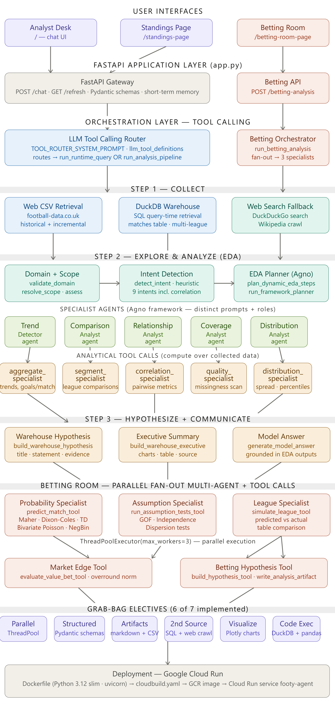
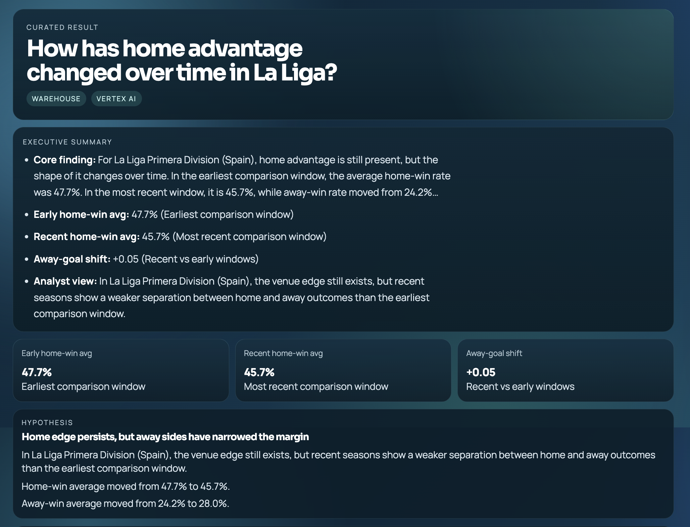
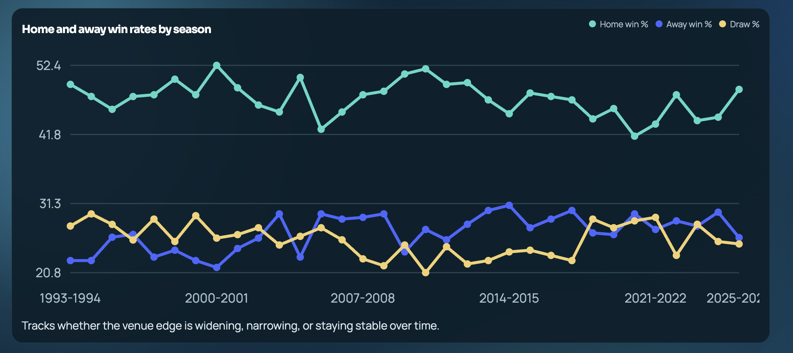
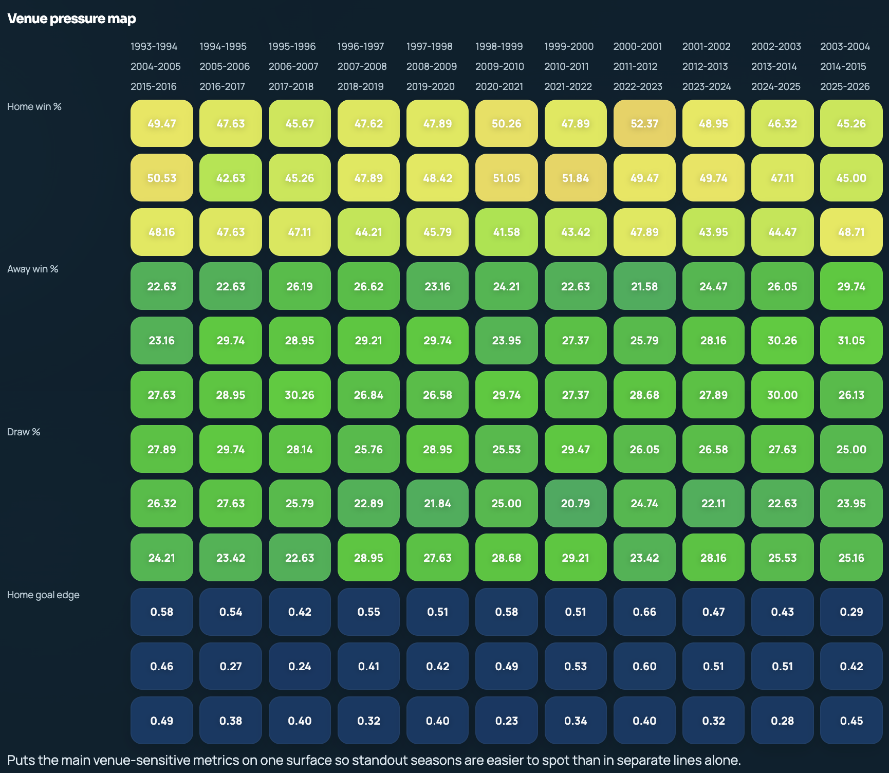
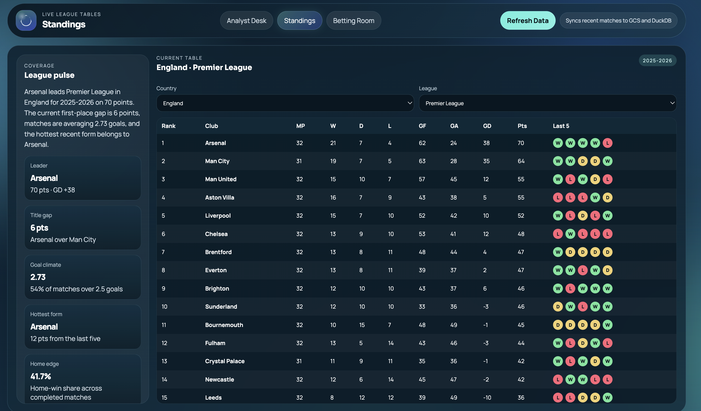
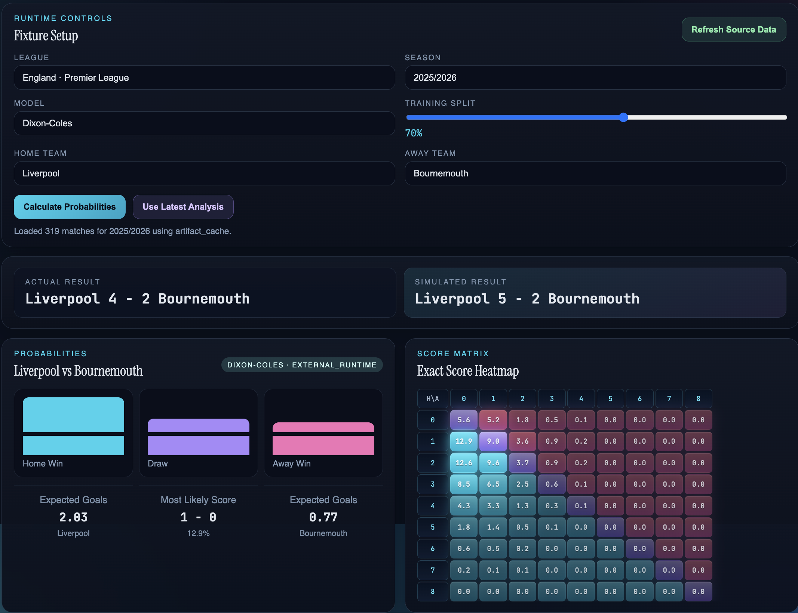
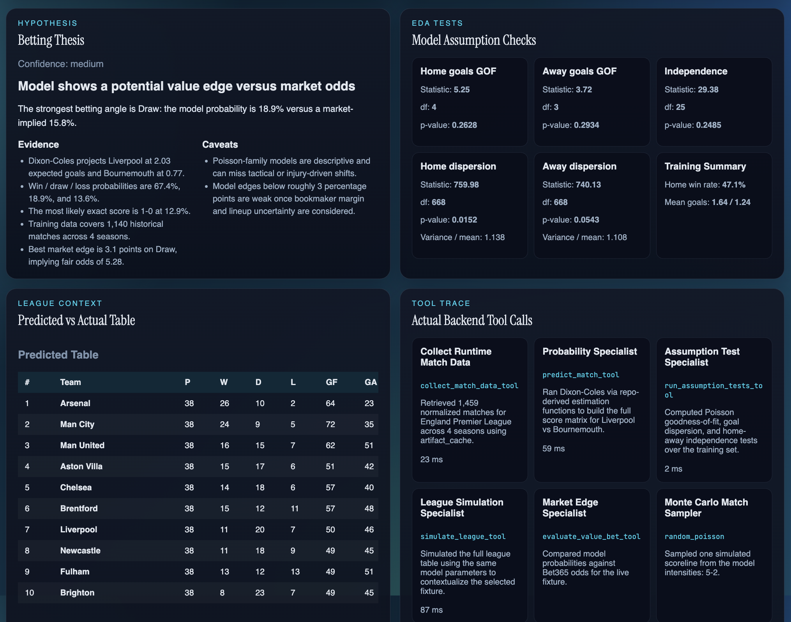

# Footy Agent

[Live App](https://footy-agent-648786197436.us-central1.run.app)

**Main surfaces:** `/`, `/standings-page`, `/betting-room-page`

Footy Agent is designed to be useful both for football newcomers and for users who want a more analytical view of the game.

For a beginner, the project works as an interactive football explainer: a user can ask simple questions about leagues, scoring, home advantage, missing data, correlations, and general football concepts, and the app responds with grounded summaries instead of requiring the user to already understand the sport’s statistics ecosystem.

For a more analytical user, the system acts like a lightweight football research assistant. It can surface long-term league trends, compare competitions, inspect data quality, identify relationships between match metrics, and turn those findings into a concrete hypothesis with supporting evidence.

For a betting-oriented user, the Betting Room extends that workflow into decision support. It retrieves current and historical match data, estimates probabilities with Poisson-family models, compares those probabilities against bookmaker odds when available, and produces a betting thesis that highlights whether the model sees a meaningful edge or only a weak lean.

In short, the project is meant to cover three practical use cases in one system:

- learn football and football analytics as a beginner
- explore league and team trends with evidence-backed summaries and hypotheses
- evaluate fixture-level betting angles using probabilities, odds comparisons, and model caveats

Footy Agent is a football data analyst system built for the first half of a real analyst workflow:

1. `Collect` real football data at runtime
2. `Explore` that data with explicit analytical tools
3. `Hypothesize` from the evidence and communicate the result

The project ships as a single FastAPI application with two user-facing analysis surfaces:

- `Analyst Desk` at `/`: a chat-driven football analytics assistant over a DuckDB warehouse
- `Betting Room` at `/betting-room-page`: a separate runtime probability-analysis page for a chosen fixture using Poisson-family models, statistical tests, and a betting thesis


## System Design

### End-to-End Architecture

<!--  -->

<p align="center">
  
</p>


Footy Agent is designed as a **layered football analytics platform** rather than a single chatbot call. The architecture separates the product into clear tiers so that each part of the workflow maps to a real engineering responsibility.

At the top are the **three user-facing surfaces**:

- **Analyst Desk** at `/` for conversational football analytics
- **Standings Page** at `/standings-page` for league tables and refresh-aware monitoring
- **Betting Room** at `/betting-room-page` for fixture-level probability analysis and betting decision support

These UIs call a shared **FastAPI application layer** in `app.py`, which acts as the gateway for chat requests, standings requests, betting requests, and warehouse refresh operations.

Beneath that sits the **orchestration layer**, where the application decides how a user request should be handled. On the Analyst Desk side, an **LLM tool-calling router** determines whether the query should go through a direct runtime query path or the broader football analysis pipeline. On the Betting Room side, a dedicated betting orchestrator runs a more mathematical workflow with multiple specialists.

The analytics flow then follows the assignment’s required structure:

### Step 1 — Collect

The system can collect football data from multiple sources:

- **Web CSV retrieval** from `football-data.co.uk`
- **DuckDB warehouse retrieval** for large multi-league historical analysis
- **Web search / crawl fallback** for football questions outside warehouse coverage

This gives the application more than one retrieval method and allows it to choose the source that best matches the user’s request.

### Step 2 — Explore & Analyze

Once data is available, the system performs a structured EDA pipeline:

- **Domain + Scope resolution** checks whether the question is football-related and determines the relevant league, country, team, or season
- **Intent detection** classifies the request into analytical categories such as trends, comparisons, correlations, or data quality
- **EDA Planner (Agno)** selects the most useful analytical steps for the question
- **Specialist agents** then execute focused roles:
  - Trend Detector
  - Comparison Analyst
  - Relationship Analyst
  - Coverage Analyst
  - Distribution Analyst

These specialist roles are backed by concrete analytical tool calls over collected data, such as season aggregation, league segmentation, pairwise correlation analysis, missingness scans, and distribution summaries.

### Step 3 — Hypothesize & Communicate

After the EDA is complete, the system turns the evidence into a user-facing analytical deliverable:

- a **warehouse hypothesis**
- an **executive summary**
- charts and tables
- a grounded **model answer**

This means the final response is not just freeform LLM text; it is the output of a pipeline that first collects, then analyzes, then synthesizes.

### How DuckDB Is Used

DuckDB is the system’s **local analytical warehouse** and is central to the Analyst Desk workflow.

Instead of loading raw CSV files directly into prompt context, the project stores football data in a structured DuckDB database and queries it at runtime. This allows the application to operate over a non-trivial dataset spanning multiple countries, leagues, seasons, match-level facts, goals, shots, cards, corners, and bookmaker odds fields where available.

DuckDB is used in two important ways:

1. **Query-time retrieval**: for warehouse-answerable questions, the app opens the DuckDB database and runs analytical queries over the `matches` table.
2. **Analytical compute engine**: DuckDB powers grouped aggregations, time-based trend analysis, filtered league/team slices, correlation preparation, and completeness scans.

So DuckDB serves as both the **warehouse** and the **runtime query engine** for football analytics.

## Repository Map

- [scripts/app.py](scripts/app.py): FastAPI entrypoint, API schemas, tool-calling router, runtime query path, chat response assembly, refresh job endpoints
- [scripts/football_ui_service.py](scripts/football_ui_service.py): domain gating, scope resolution, answerability checks, question classification, dynamic EDA planning, warehouse analytics, chart builders, hypothesis builders, framework-backed specialist agents
- [scripts/betting_room_service.py](scripts/betting_room_service.py): runtime match retrieval, Poisson-family models, statistical test tools, market-edge evaluation, parallel specialist fan-out, artifact writing
- [scripts/football_data_to_gcs.py](scripts/football_data_to_gcs.py): incremental football-data refresh from external web sources into storage and DuckDB
- [scripts/historical_football_data_to_gcs.py](scripts/historical_football_data_to_gcs.py): historical warehouse build from external football data pages and CSVs
- [scripts/football_web_fallback.py](scripts/football_web_fallback.py): live web search and crawl fallback when a football question is outside warehouse coverage
- [scripts/football_eda.py](scripts/football_eda.py): standalone Plotly + DuckDB EDA tool that writes persistent visual artifacts
- [frontend/templates/index.html](frontend/templates/index.html): Analyst Desk HTML
- [frontend/templates/standings.html](frontend/templates/standings.html): standings page HTML
- [frontend/templates/betting_room.html](frontend/templates/betting_room.html): Betting Room HTML
- [frontend/static/js/app.js](frontend/static/js/app.js): Analyst Desk frontend state, rendering, chart drawing, short-term conversation memory
- [frontend/static/js/standings.js](frontend/static/js/standings.js): standings page client logic
- [frontend/static/js/betting_room.js](frontend/static/js/betting_room.js): betting page rendering and API interaction
- [frontend/static/css/styles.css](frontend/static/css/styles.css), [frontend/static/css/betting_room.css](frontend/static/css/betting_room.css): UI styling
- [cloudbuild.yaml](cloudbuild.yaml): Google Cloud Run deployment pipeline
- [Dockerfile](Dockerfile): runtime container
- [pyproject.toml](pyproject.toml): dependencies including `agno`, `fastapi`, `duckdb`, `litellm`, `plotly`, and `pydantic`

## What The Application Actually Does

### Analyst Desk

The Analyst Desk accepts football questions and routes them through a strict three-mode policy:

1. `Warehouse-backed football analysis`
   If the question is football-related and the local DuckDB warehouse contains the needed grain, the app returns:
   - direct answer
   - executive summary
   - question-specific EDA charts
   - supporting table when relevant
   - data-backed hypothesis
   - compact source block

2. `External football fallback`
   If the question is football-related but outside warehouse coverage, the app performs live external retrieval and returns an external football answer package.

3. `Out-of-context`
   If the question is not about football/soccer, the app returns an explicit out-of-context response.

This logic lives in [chat_response](scripts/football_ui_service.py), which is called from [build_chat_payload](scripts/app.py).

#### Analyst Desk Example Output



*Example of a warehouse-backed answer for **“How has home advantage changed over time in La Liga?”** The response includes a curated result card, executive summary, KPI tiles, and a grounded hypothesis rather than only freeform chat text.*



*The analyst workflow also renders question-specific visualizations. This season-level line chart shows home-win, away-win, and draw rates over time so the user can directly inspect whether venue advantage is widening, narrowing, or staying stable.*



*The venue pressure map compresses multiple venue-sensitive metrics into one surface, making standout seasons easier to detect than in separate charts alone.*


### Standings Page




*The standings page is a separate refresh-aware surface that gives league-table context, form signals, title-gap summaries, and quick monitoring of current-season league state.*


### Betting Room

The Betting Room is a second, distinct analysis surface. It is not just a static calculator. It performs a runtime mini-pipeline for a selected fixture:

1. collect live or cached league-season match data
2. assemble a historical training set
3. estimate match probabilities with a selected model
4. run model-assumption checks
5. simulate league context
6. compare model probabilities to available bookmaker odds
7. synthesize the findings into a betting hypothesis
8. write a persistent markdown artifact to disk

The entrypoint is [run_betting_analysis](scripts/betting_room_service.py).


#### Betting Room Example Output



*The Betting Room lets the user choose a league, season, model, and fixture, then returns win/draw/loss probabilities, expected goals, most likely score, and an exact-score heatmap built from the fitted model.*



*Below the headline probabilities, the page exposes model-assumption checks, predicted-vs-actual table context, and backend tool traces so the final betting thesis remains inspectable and evidence-backed.*

## Flow

## Step 1: Collect

This project satisfies `Collect` through real runtime retrieval from external football data sources. The data is not stored in the prompt and is not a tiny hand-curated CSV.

### Collection Method 1: Runtime Web Retrieval / Crawling

Implemented in:

- [scripts/historical_football_data_to_gcs.py](scripts/historical_football_data_to_gcs.py)
- [scripts/football_data_to_gcs.py](scripts/football_data_to_gcs.py)
- [collect_match_data_tool](scripts/betting_room_service.py)
- [fetch_external_season_matches](scripts/betting_room_service.py)
- [fetch_runtime_csv](scripts/betting_room_service.py)

What happens:

- the historical script discovers football-data pages
- parses country pages
- finds season CSV links
- downloads the CSVs at runtime
- normalizes the rows
- writes warehouse-ready outputs

The incremental script repeats the process for recently affected datasets and supports parallel workers.

The betting page also performs runtime CSV retrieval for selected league-season combinations such as:

```text
https://www.football-data.co.uk/mmz4281/<season_id>/<league_id>.csv
```

### Collection Method 2: SQL-Style Warehouse Retrieval

Implemented in:

- [open_connection](scripts/football_ui_service.py)
- [try_runtime_query_payload](scripts/app.py)
- the family of warehouse fetchers in [scripts/football_ui_service.py](scripts/football_ui_service.py), including:
  - `fetch_season_trend_frame`
  - `fetch_data_quality_frame`
  - `fetch_correlation_frame`
  - `fetch_team_season_frame`
  - `fetch_match_feature_frame`

What happens:

- DuckDB is treated as a real analysis warehouse
- the app opens the database at runtime
- selects the relevant slice by country / league / season / team
- executes analytical queries over the `matches` table

This satisfies the requirement that the dataset is large and abstract enough that it must be queried rather than dumped into model context.

### Collection Method 3: Live Web Search / Crawl Fallback

Implemented in:

- [scripts/football_web_fallback.py](scripts/football_web_fallback.py)

Key functions:

- `search_duckduckgo`
- `fetch_wikipedia_documents`
- `crawl_page_text`
- `hydrate_documents`
- `build_web_fallback_bundle`

What happens:

- for football questions outside warehouse coverage, the app performs runtime search and crawl retrieval
- collects external snippets and page text
- packages them into an external football answer

## Step 2: Explore and Analyze (EDA)

This project satisfies `EDA` by explicitly computing over collected data before answering. It does not jump directly from question to unsupported model prose.

### Analyst Desk EDA Pipeline

Core EDA routing lives in [scripts/football_ui_service.py](scripts/football_ui_service.py).

#### 1. Domain and Scope Resolution

- [validate_domain](scripts/football_ui_service.py): checks whether the question is football-related
- [resolve_scope](scripts/football_ui_service.py): determines the requested country / league / team / season scope
- [assess_answerability](scripts/football_ui_service.py): checks whether the warehouse can answer the question

#### 2. Intent Detection

- [detect_intent](scripts/football_ui_service.py)
- [heuristic_intent](scripts/football_ui_service.py)

Supported warehouse-oriented intents include:

- `count_lookup`
- `team_recent_claim`
- `team_performance`
- `home_advantage`
- `correlation`
- `data_quality`
- `league_compare`
- `scoring`
- `overview`

#### 3. Dynamic EDA Planning

- [plan_dynamic_eda_steps](scripts/football_ui_service.py)
- [suggest_eda_step](scripts/football_ui_service.py)
- [run_framework_planner_decision](scripts/football_ui_service.py)

The planner decides which EDA steps are useful for the current slice. The available steps are:

- `trend`
- `segment`
- `correlation`
- `quality`
- `distribution`

This matters for the rubric because the EDA is dynamic. Different user questions can trigger different tools and different evidence pathways.

#### 4. Specialist EDA Tasks

Implemented in [scripts/football_ui_service.py](scripts/football_ui_service.py):

- [aggregate_specialist_task](scripts/football_ui_service.py)
  - computes season-level trend signals
  - example outputs: goals per match, home-win rate shifts

- [segment_specialist_task](scripts/football_ui_service.py)
  - groups the selected slice by comparison categories
  - example outputs: league comparisons, latest visible context

- [correlation_specialist_task](scripts/football_ui_service.py)
  - computes pairwise metric correlations
  - example variables:
    - `total_goals`
    - `total_shots`
    - `total_shots_on_target`
    - `total_corners`
    - `total_cards`

- [quality_specialist_task](scripts/football_ui_service.py)
  - computes missingness / coverage patterns over seasons
  - example outputs: `hs_missing_pct`, `hst_missing_pct`, referee/time completeness

- [distribution_specialist_payload](scripts/football_ui_service.py)
  - computes spread and percentile summaries for high-variance numeric columns

#### 5. Warehouse-Specific Rendering

- [build_warehouse_charts](scripts/football_ui_service.py)
- [build_warehouse_hypothesis](scripts/football_ui_service.py)
- [build_warehouse_executive_summary](scripts/football_ui_service.py)
- [enrich_warehouse_payload](scripts/football_ui_service.py)

This is where the app became question-specific rather than generic. A missing-data question now gets missing-data charts and a missing-data hypothesis, while a correlation question gets correlation-oriented outputs.

### Standalone EDA Tool Script

The repository also includes a separate EDA CLI:

- [scripts/football_eda.py](scripts/football_eda.py)

This script uses:

- `duckdb`
- `pandas`
- `plotly`

It computes and writes persistent analysis artifacts such as overview summaries, aggregate trend views, segment comparisons, correlation outputs, missingness scans, outlier/distribution plots.

Examples:

- strongest metric pair and correlation coefficient
- early-vs-recent shot missingness change
- home advantage trend shift
- team performance movement over seasons

## Step 3: Hypothesize

This project  `Hypothesize` by building grounded claims from the EDA outputs.

### Analyst Desk Hypothesis Path

Implemented in:

- [build_warehouse_hypothesis](scripts/football_ui_service.py)
- [build_warehouse_executive_summary](scripts/football_ui_service.py)
- [generate_model_answer](scripts/app.py)

The hypothesis is not raw LLM improvisation. It is assembled from:

- the selected warehouse slice
- computed aggregates
- detected trend changes
- correlation outputs
- completeness / quality signals

Typical hypothesis components:

- a title
- a short statement
- evidence bullets
- confidence
- caveats

### Betting Room Hypothesis Path

Implemented in:

- [build_hypothesis_tool](scripts/betting_room_service.py)
- [write_analysis_artifact](scripts/betting_room_service.py)

The betting hypothesis uses:

- expected goals
- win/draw/loss probabilities
- most likely score
- size of historical training data
- dispersion caveats
- bookmaker edge comparison when odds are available

This is a direct data-backed “so what?” layer, which is exactly what the hypothesis stage is supposed to produce.

## Core Implementation

### Frontend

Primary UI files:

- [frontend/templates/index.html](frontend/templates/index.html)
- [frontend/static/js/app.js](frontend/static/js/app.js)
- [frontend/templates/standings.html](frontend/templates/standings.html)
- [frontend/static/js/standings.js](frontend/static/js/standings.js)
- [frontend/templates/betting_room.html](frontend/templates/betting_room.html)
- [frontend/static/js/betting_room.js](frontend/static/js/betting_room.js)

Frontend behavior includes:

- question submission
- chat history rendering
- question-specific chart rendering
- background refresh polling
- standings interaction
- betting model selection
- probability and test visualization

### Agent Framework

Evidence:

- dependency in [pyproject.toml](pyproject.toml)
- imports in [scripts/football_ui_service.py](scripts/football_ui_service.py):
  - `from agno.agent import Agent as AgnoAgent`
  - `from agno.models.litellm import LiteLLM as AgnoLiteLLM`

Framework-specific functions:

- [framework_agents_enabled](scripts/football_ui_service.py)
- [build_agno_model](scripts/football_ui_service.py)
- [run_framework_planner_decision](scripts/football_ui_service.py)
- [run_framework_specialist_agent](scripts/football_ui_service.py)

Framework-backed agent roles:

- `EDA Planner Agent`
- `Trend Detector Agent`
- `Comparison Analyst Agent`
- `Relationship Analyst Agent`
- `Coverage Analyst Agent`
- `Distribution Analyst Agent`

These roles use distinct prompts and responsibilities, which helps satisfy the multi-agent requirement in a traceable way.

### Tool Calling

Implemented in two layers.

#### Layer 1: LLM Tool Calling In The Analyst Desk

Implemented in [scripts/app.py](scripts/app.py).

Key pieces:

- [TOOL_ROUTER_SYSTEM_PROMPT](scripts/app.py)
- [llm_tool_definitions](scripts/app.py)
- [execute_llm_tool_call](scripts/app.py)
- [try_tool_calling_chat_payload](scripts/app.py)

The router can choose between:

- `run_runtime_query`
- `run_analysis_pipeline`

This is a genuine tool-routing layer, not just hard-coded branching.

#### Layer 2: Backend Analysis Tools

Analyst tools:

- [aggregate_specialist_task](scripts/football_ui_service.py)
- [segment_specialist_task](scripts/football_ui_service.py)
- [correlation_specialist_task](scripts/football_ui_service.py)
- [quality_specialist_task](scripts/football_ui_service.py)

Betting tools:

- [collect_match_data_tool](scripts/betting_room_service.py)
- [predict_match_tool](scripts/betting_room_service.py)
- [run_assumption_tests_tool](scripts/betting_room_service.py)
- [simulate_league_tool](scripts/betting_room_service.py)
- [evaluate_value_bet_tool](scripts/betting_room_service.py)
- [build_hypothesis_tool](scripts/betting_room_service.py)

Primary source:

- `football-data.co.uk`

Warehouse and retrieval files:

- [scripts/historical_football_data_to_gcs.py](scripts/historical_football_data_to_gcs.py)
- [scripts/football_data_to_gcs.py](scripts/football_data_to_gcs.py)
- [scripts/football_ui_service.py](scripts/football_ui_service.py)
- [scripts/betting_room_service.py](scripts/betting_room_service.py)

The system explicitly treats the data as a warehouse and runs query-time analytics over it.

### Multi-Agent Pattern

Implemented in two strong forms.

#### Pattern 1: Orchestrator -> Specialist Analysts

In [scripts/football_ui_service.py](scripts/football_ui_service.py):

- orchestrator: [plan_dynamic_eda_steps](scripts/football_ui_service.py)
- optional framework planner: [run_framework_planner_decision](scripts/football_ui_service.py)
- specialist execution: [run_framework_specialist_agent](scripts/football_ui_service.py)

This is a classic orchestrator-handoff pattern:

- planner chooses the next EDA steps
- specialist roles execute focused analytical responsibilities
- outputs are aggregated into one final hypothesis package

#### Pattern 2: Fan-Out Parallel Specialists In Betting Room

In [run_betting_analysis](scripts/betting_room_service.py):

- `probability_specialist`
- `assumption_specialist`
- `league_specialist`

These run concurrently via:

```python
with ThreadPoolExecutor(max_workers=3) as executor:
```

This is a clear parallel multi-agent / multi-specialist pattern.

### Deployed

The repository includes a full deployment path for Google Cloud Run.

Evidence:

- [Dockerfile](Dockerfile)
- [cloudbuild.yaml](cloudbuild.yaml)
- [scripts/app.py](scripts/app.py)

Cloud build steps:

- build image
- push image
- deploy service `footy-agent` to Cloud Run


## Grab-Bag Concepts

This project implements below concepts.

### 1. Parallel Execution

Evidence:

- [run_dynamic_eda](scripts/football_ui_service.py)
- [run_betting_analysis](scripts/betting_room_service.py)

Parallelism is used to reduce latency and to aggregate independent specialist outputs.

### 2. Structured Output

API schemas in [scripts/app.py](scripts/app.py):

- `ChatRequest`
- `ChatResponse`
- `BettingRoomRequest`
- `RefreshRequest`
- `RefreshResponse`
- `RefreshStatusResponse`

Framework schemas in [scripts/football_ui_service.py](scripts/football_ui_service.py):

- `EdaPlannerDecision`
- `SpecialistDigest`

Structured payloads are also used for:

- charts
- tables
- highlights
- hypothesis blocks
- source cards
- tool traces

### 3. Artifacts

Persistent artifact generation:

- [write_analysis_artifact](scripts/betting_room_service.py): writes markdown reports for betting analyses
- [scripts/football_eda.py](scripts/football_eda.py): writes Plotly HTML artifacts and analysis outputs under `artifacts/eda`
- betting-room runtime data cache also persists under `artifacts/betting_room/data`

### 4. Second Data Retrieval Method

This project uses multiple retrieval modes:

- external CSV retrieval from `football-data.co.uk`
- DuckDB query-time retrieval
- live web search and crawl fallback

### 5. Data Visualization

Backend chart constructors in [scripts/football_ui_service.py](scripts/football_ui_service.py):

- `line_chart`
- `bar_chart`
- `area_chart`
- `dumbbell_chart`
- `heatmap_chart`

Warehouse chart selection:

- [build_warehouse_charts](scripts/football_ui_service.py)

Frontend rendering:

- [renderCharts](frontend/static/js/app.js)

Betting Room visualizations:

- probability bars
- exact-score heatmap
- assumption-check cards
- predicted-vs-actual table comparison
- backend tool trace

### 6. Code Execution

The project performs real runtime code execution using:

- DuckDB SQL execution
- pandas transformations
- mathematical probability calculations
- statistical tests
- Plotly artifact generation

This is visible in:

- [scripts/football_ui_service.py](scripts/football_ui_service.py)
- [scripts/betting_room_service.py](scripts/betting_room_service.py)
- [scripts/football_eda.py](scripts/football_eda.py)

## Analyst Desk: Technical Architecture

### Chat Request Lifecycle

1. `POST /chat` receives the message
2. [build_chat_payload](scripts/app.py) optionally resolves short-term context from the last five turns
3. [try_tool_calling_chat_payload](scripts/app.py) lets the model choose the right tool path
4. if a direct query is appropriate, [try_runtime_query_payload](scripts/app.py) builds a DuckDB query
5. otherwise [chat_response](scripts/football_ui_service.py) runs the full football analysis pipeline
6. [generate_model_answer](scripts/app.py) turns the structured result into the final answer text

### Runtime Query Path

The narrow SQL-answerable path is implemented in [scripts/app.py](scripts/app.py).

Key prompts:

- `QUERY_PLANNER_SYSTEM_PROMPT`
- `QUERY_SUMMARY_SYSTEM_PROMPT`

Important properties:

- read-only SQL only
- only the `matches` table
- direct factual questions
- concise query results summarized back to the user

### Football Analysis Path

The broader warehouse path is implemented in [chat_response](scripts/football_ui_service.py).

Main stages:

1. domain validation
2. football scope resolution
3. answerability check
4. question intent classification
5. warehouse or external path selection
6. question-specific chart / summary / hypothesis generation

### Short-Term Conversational Memory

The Analyst Desk also keeps a short rolling memory of the last five turns for scope carryover.

Implemented in:

- [ChatRequest](scripts/app.py): `history`
- [resolve_message_with_recent_context](scripts/football_ui_service.py)
- [scope_from_history_entry](scripts/football_ui_service.py)
- [apply_recent_scope](scripts/football_ui_service.py)
- [frontend/static/js/app.js](frontend/static/js/app.js): sends last five turns with the chat request

This is used for vague follow-ups like:

- `here`
- `that league`
- `this team`
- `what about that one`

## Betting Room: Technical And Mathematical Detail

The betting page is intentionally more mathematical and tool-heavy than the main chat flow.

### Betting Models Implemented

The selectable models are defined in [MODEL_NAMES](scripts/betting_room_service.py):

- `Maher`
- `Dixon-Coles`
- `Dixon-Coles TD`
- `Bivariate Poisson`
- `Negative Binomial`

### Data Collection In Betting Room

Implemented in:

- [collect_match_data_tool](scripts/betting_room_service.py)
- [fetch_external_season_matches](scripts/betting_room_service.py)
- [fetch_duckdb_season_matches](scripts/betting_room_service.py)

Behavior:

- fetch chosen season from external CSV if available
- cache normalized matches under `artifacts/betting_room/data`
- fall back to DuckDB warehouse when necessary
- assemble current-season and historical training data across multiple seasons

### Mathematical Building Blocks

Implemented in [scripts/betting_room_service.py](scripts/betting_room_service.py):

- `poisson_pmf`
- `neg_bin_pmf`
- `bivariate_poisson_pmf`
- `dixon_coles_tau`
- [random_poisson](scripts/betting_room_service.py)
- [estimate_params](scripts/betting_room_service.py)
- [estimate_rho](scripts/betting_room_service.py)
- [estimate_lambda_three](scripts/betting_room_service.py)
- [estimate_dispersion](scripts/betting_room_service.py)
- [build_matrix](scripts/betting_room_service.py)

#### Maher Model

The Maher-style model assumes independent home and away goal counts, with team attack/defense strengths and a home-advantage term.

The implemented expected goals are of the form:

```text
lambda_home = attack_home * defense_away * exp(home_adv)
lambda_away = attack_away * defense_home
```

This path is selected in [predict_from_params](scripts/betting_room_service.py) when `model_name == "Maher"`.

#### Dixon-Coles Model

The Dixon-Coles version starts from the independent Poisson structure and then adjusts low-score outcomes using a correlation correction term `rho` via `dixon_coles_tau`.

This is appropriate because football scores are often sparse and low-score dependence matters.

Implemented in:

- [estimate_rho](scripts/betting_room_service.py)
- [dixon_coles_tau](scripts/betting_room_service.py)
- [predict_from_params](scripts/betting_room_service.py)

#### Dixon-Coles TD

`TD` means time-decay. Older matches are downweighted using:

```text
weight_i = exp(-xi * age_index)
```

Implemented in:

- [predict_match_tool](scripts/betting_room_service.py)
- [simulate_league_tool](scripts/betting_room_service.py)

This lets recent form influence parameter estimation more than stale historical matches.

#### Bivariate Poisson

The Bivariate Poisson model adds a shared latent component `lambda_three` so home and away goals can co-move rather than being fully independent.

Implemented in:

- [bivariate_poisson_pmf](scripts/betting_room_service.py)
- [estimate_lambda_three](scripts/betting_room_service.py)
- [predict_from_params](scripts/betting_room_service.py)

This is useful when a fixture’s two scorelines share common intensity.

#### Negative Binomial

The Negative Binomial path handles over-dispersion better than the pure Poisson family when goal variance exceeds the mean.

Implemented in:

- `neg_bin_pmf`
- [estimate_dispersion](scripts/betting_room_service.py)
- [predict_from_params](scripts/betting_room_service.py)

This is especially relevant when the training data is more variable than a Poisson assumption can comfortably explain.

### Statistical Tests In Betting Room

The betting page explicitly runs test-like analytical tools before building the thesis.

Implemented in:

- [poisson_goodness_of_fit_test](scripts/betting_room_service.py)
- [independence_test](scripts/betting_room_service.py)
- [dispersion_test](scripts/betting_room_service.py)
- [run_assumption_tests_tool](scripts/betting_room_service.py)

What they do:

- `GOF`: checks whether observed goal counts are plausibly consistent with a Poisson-style distribution
- `Independence`: checks whether home and away goal outcomes behave independently enough for the simpler models
- `Dispersion`: checks whether the variance-to-mean relationship suggests under/over-dispersion

These are surfaced in the Betting Room UI as `Model Assumption Checks`.

### League Simulation Tool

Implemented in [simulate_league_tool](scripts/betting_room_service.py).

What it does:

- uses the fitted model to generate score expectations for fixtures
- builds a predicted league table
- compares predicted top teams against the actual observed table

This gives the fixture prediction broader context rather than leaving it as an isolated scoreline.

### Market Edge Tool

Implemented in [evaluate_value_bet_tool](scripts/betting_room_service.py).

What it does:

- extracts bookmaker odds when available
- converts odds to implied probabilities
- normalizes the overround
- compares market-implied probabilities with model probabilities
- identifies the strongest edge
- computes fair odds

The core logic is:

```text
edge = model_probability - market_implied_probability
fair_odds = 1 / model_probability
```

This is then used by the hypothesis builder.

### Betting Hypothesis Synthesis

Implemented in [build_hypothesis_tool](scripts/betting_room_service.py).

This tool combines:

- expected goals
- win/draw/loss probabilities
- most likely score
- training set size
- statistical caveats
- market edge if present

It returns a structured object with:

- `title`
- `statement`
- `confidence`
- `evidence`
- `caveats`
- `next_checks`

### Betting Room Multi-Agent Fan-Out

`run_betting_analysis` uses a clean specialist fan-out pattern:

- `probability_specialist`
- `assumption_specialist`
- `league_specialist`

These run in parallel and return both:

- machine-usable result payloads
- human-readable tool trace summaries

After that, the pipeline adds:

- `market_edge`
- `simulate_match`
- `betting_hypothesis`

### Betting Room Artifact Generation

Implemented in [write_analysis_artifact](scripts/betting_room_service.py).

Persistent outputs include:

- markdown report file
- cached runtime data files

These live under:

- `artifacts/betting_room/data`
- `artifacts/betting_room/reports`

## Visualization Layer

### Analyst Desk Visualizations

The main analyst page renders multiple chart types depending on the question:

- line charts
- bar charts
- heatmaps / pressure maps
- question-specific comparison charts

Chart constructors are implemented in [scripts/football_ui_service.py](scripts/football_ui_service.py).

Chart rendering lives in [frontend/static/js/app.js](frontend/static/js/app.js).

### Betting Room Visualizations

Rendered in [frontend/static/js/betting_room.js](frontend/static/js/betting_room.js):

- probability bars for home/draw/away
- exact score matrix heatmap
- assumption-check cards
- predicted-vs-actual table comparison
- backend tool trace panel

## Deployment

The application is packaged for **Google Cloud Run** and supports both a bundled local DuckDB mode and a **GCS-backed DuckDB snapshot mode**.

### Container

Implemented in [Dockerfile](Dockerfile):

- uses Python 3.12 slim
- installs dependencies via `uv`
- starts `uvicorn`
- serves the FastAPI app and frontend templates from a single container image

### Cloud Build

Implemented in [cloudbuild.yaml](cloudbuild.yaml):

- build Docker image
- push image to GCR
- deploy service `footy-agent`

### DuckDB + GCS Deployment Pattern

For Cloud Run, the project supports a cloud-backed warehouse pattern:

1. a DuckDB snapshot is stored in GCS
2. Cloud Run starts a new revision
3. the application syncs the DuckDB file locally into the running container
4. runtime analytical queries execute against the local DuckDB copy
5. refresh jobs can publish a newer snapshot back to GCS

This gives the service a strong balance between:

- **fast local analytical performance** from DuckDB
- **durable cloud-backed persistence** through GCS
- **portable warehouse state** across deployments and revisions

The submitted assignment URL should point to the deployed service produced from this pipeline.

## Running Locally

Install dependencies:

```bash
uv sync
```

Alternative:

```bash
python3 -m pip install -r requirements.txt
```

Run:

```bash
uv run uvicorn app:app --reload
```

Open in a browser:

- `http://127.0.0.1:8000/`
- `http://127.0.0.1:8000/standings-page`
- `http://127.0.0.1:8000/betting-room-page`

## Environment Variables

Core variables:

- `MODEL`
- `LITELLM_API_BASE`
- `LITELLM_API_KEY`
- `DUCKDB_PATH`
- `DUCKDB_GCS_URI`
- `SYNC_DUCKDB_FROM_GCS`
- `MODEL_TIMEOUT_SECONDS`

Typical example:

```env
MODEL=vertex_ai/gemini-2.5-flash-lite
DUCKDB_PATH=football_data.duckdb
```

## Refresh Workflow

The project includes a **non-blocking refresh architecture** for the warehouse so the UI stays responsive while data sync runs in the background.

Implemented in [scripts/app.py](scripts/app.py):

- `POST /refresh`
- `GET /refresh/{job_id}`
- [run_refresh_job](scripts/app.py)

### End-to-End Refresh Flow

When the homepage **Refresh Data** button is clicked:

1. the frontend sends `POST /refresh`
2. this is triggered from [frontend/static/js/app.js](frontend/static/js/app.js)
3. the backend route `refresh_data(...)` creates a background refresh job
4. the route immediately returns a `job_id`
5. the backend starts a daemon thread with `run_refresh_job(...)`
6. the frontend polls `GET /refresh/{job_id}`
7. polling continues until the job is no longer `queued` or `running`

Inside the background thread, the application runs the incremental refresh script through `run_refresh_job(...)`.

### Why This Design Is Important

This keeps the request/response path fast for the user. The browser does not need to wait for the full warehouse update to finish before getting a response.

It also gives the system a form of **application-level atomicity** and safe publication semantics:

- the refresh runs in the background
- the job only reaches a successful terminal state if the refresh subprocess completes successfully
- only after success is the updated DuckDB snapshot eligible to be published back to GCS
- if the refresh fails or times out, the old published snapshot remains the last valid warehouse version

So the system avoids exposing a half-written or partially refreshed warehouse snapshot.

### Concurrency Safety

The refresh layer also uses a refresh lock and a single active-job tracker so that:

- only one refresh job is active at a time
- concurrent writers do not publish overlapping warehouse states
- the frontend always has a single refresh status to poll

This makes the refresh workflow much more production-like than a synchronous blocking update triggered directly from the request thread.

## Example Questions

Warehouse-backed questions:

- `How has home advantage changed over time in La Liga?`
- `Which columns have the most missing data by season in the Premier League?`
- `Show me the strongest metric correlations in Serie A.`
- `Compare Bundesliga and Serie A on scoring trends.`
- `How complete is referee data in Ligue 1?`

External football fallback questions:

- `What is offside?`
- `Which football league has the highest revenue?`

Out-of-context examples:

- `What is the weather in New York today?`
- `Summarize Bitcoin prices this week.`

## Testing

Repository tests:

```bash
uv run pytest
```

Available test files:

- [evals/test_betting_room.py](evals/test_betting_room.py)
- [evals/test_deterministic.py](evals/test_deterministic.py)
